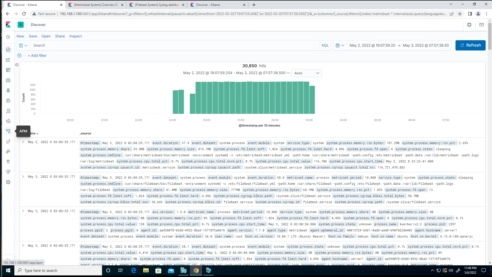

## Week 20 - Activity 2 - Incident Analysis with Kibana
____
### 1. Identify the traffic between your machine and the web machine:  

*When did the interaction occur?*
   
   - **The attack started on May 2 2022 @ 23:00 and continued through  May 5 2022 @ 03:00**



*What responses did the victim send back?*
-  **http.response.status_code - 401, 301, 207 and 404**


 *What data is concerning from the Blue Team perspective?*

- **There were 28,228 (401) responses indicating that someone was failing to authenticate to the server.**
   
   

___

### 2. Find the request for the hidden directory.  In your attack, you found a secret folder:

*How many requests were made to this directory? At what time and from which IP address(es)?* 
- **38,829 hits to this url May 3, 2022 @ 00:00 from 192.168.1.90.**


*Which files were requested? What information did they contain?*
- `http://192.168.1.105/company_folders/secret_folder/connect_to_corp_server`.

 

*What kind of alarm would you set to detect this behavior in the future?*

 - Set an alert for a brute force attack after monitoring a baseline.
 
 - Set an alert whenever this file is accessed.

*Identify at least one way to harden the vulnerable machine that would mitigate this attack.* 

-  Require stronger password policy for administrators or disable password authentication and authenticate via ssh key pair to allow only administrator machines to access.
-  Apply an account lock-out feature after so many attempts.
-  Enable MFA to prevent brute forcing attacks

___ 

### 3. After identifying the hidden directory, you used Hydra to brute-force the target server. 

  *Can you identify packets specifically from Hydra?*
  -  **Yes. user_agent.original: `"Mozilla/4.0 (Hydra)"`** 

  

*How many requests were made in the brute-force attack?*
-  **290,804**
	
*How many requests had the attacker made after discovering the correct password in this one?* 
- **5**


*What kind of alarm would you set to detect this behavior in the future and at what threshold(s)?*
- **I would recommend setting an alert based on a specific threshold of 5 HTTP-GET requests from the same ip address to the same resource that generates a 401 status code.** 
- **Also, setting an alert when the User-Agent includes the term “Hydra.”**

*Identify at least one way to harden the vulnerable machine that would mitigate this attack.*

- **Implement account lock-out after 5 failed attempts at accessing the webserver.**
___
### 4. Find the WebDav connection and use your dashboard to answer the following questions:

*How many requests were made to this directory?*
- **223,755**


*Which file(s) were requested?*
- **webdav/shell.php**


*What kind of alarm would you set to detect such access in the future?*

- **Alert if anyone other than those whitelisted access this folder.**

*Identify at least one way to harden the vulnerable machine that would mitigate this attack.*

- **File code/signature scan if files are uploaded.**
- **Make access to this folder only accessible from the back end.**
- **Implement a firewall rule to make this folder accessible by those whitelisted.**
___
### 5.	Identify the reverse shell and meterpreter traffic.
To finish off the attack, you uploaded a PHP reverse shell and started a meterpreter shell session. Answer the following questions:

*Can you identify traffic from the meterpreter session?*
- **Searching source port under “Available fields” I see that 4444 was at the top of the list and had a 78.8% usage. Then filtered by this to investigate it further.**


*What kinds of alarms would you set to detect this behavior in the future?*

- **An alarm if this port is used**
- **An alarm if an executable file is uploaded**


*Identify at least one way to harden the vulnerable machine that would mitigate this attack.*

- **Implement firewall rule to block this port number, ip address, and executable file type.**
- **Use file scanning software to scan for malicious code.**
- **Remove the ability to upload files.**
- **Do not allow outbound traffic from unknown ports.**

### Commands Used:
```
source.ip: 192.168.1.90 and destination.ip: 192.168.1.105
```
```
url.path: /company_folders/secret_folder/
```
```
url.path: /webdav
```
```
user_agent.original: “Mozilla/4.0 (Hydra)"
```
```
http.response.status_code: 401
```


